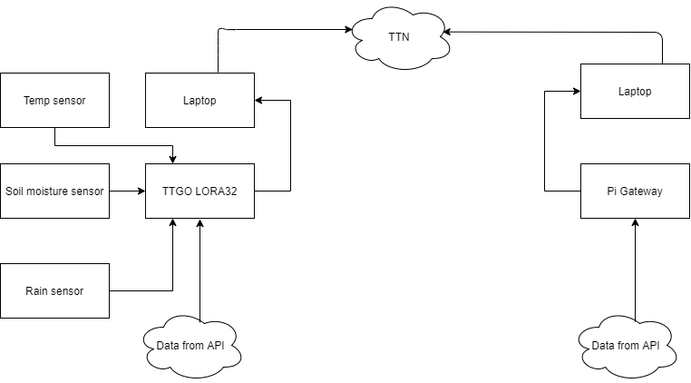

### Initial Draft

__Introduction:__
A smart RIoT (Resilient Iot) irrigation system, that gets data from temperature, soil moisture, and rain sensors based on the data from sensors the decision will be made (Pump water or do not pump water). If the sensors fail to deliver data, the decision will be made from the resilient features.

__Architecture Diagram:__

__Tasks:__

  __Task 1__
-   **Hardware Configuratuion.** 
    - Installation of `PI` OS in the gateway. 
    - Connecting all the sensors to  `ESP32`.      
    - Fixing `ESP32` on the breadboard and completing the wiring of sensors.
     - **Responsible team members:**
        - Prashanth K.
        - Prathyum Ramesh

__Task 2__    
-   **Reading Data from Sensors.** 
       - Configured   `Arduino IDE` and `Esp32` by installing all dependencies
       - Writing code for collecting the data from individual sensors.
       - Integrating all the sensor code into one  `.INO` file.
       - Processed the incoming data from sensors and producing required results.
        - **Responsible team members:**
          - Prathyum Ramesh
          - Rupesh 
          - Prashanth
    
__Task 3__  
-   **Reading Data from Cloud API**
    - Registering in `https://openweathermap.org/` and generating `API` Key. 
    - Arduino Code for collecting data from the cloud using the `API` key.
  

    - **Responsible team members:**
        - Mohammadreza
        - Somrita

__Task 4__  
-   **Connecting to TTN**
    - Registering the  lora gateway in `TTN` `www.thethingsnetwork.org`.
    - Registering the `TTGO Esp32` in `TTN`.
    - **Responsible team members:**
        - Prathyum Ramesh
        - Somrita
        - Rupesh
        - Mohammadreza 

__Task 5__  
-   **Communication between `TTGO Esp32`  and LORA gateway via `TTN`.**
    -   Setting up MQTT protocol to enable message transfer.
    - **Responsible team members:**
        - Prathyum Ramesh
        - Somrita
        - Rupesh
        - Prashanth K.
        - Mohammadreza 

 
__Task 6__  
-   **Resilience** 
    -  Overriding the faulty sensors data with the API data from the cloud.
    -  Saving the data from sensors until we get an `ACK` from PI and resend after a period of time if we don't receive the `ACK`.
    - **Responsible team members:**
        - Prashanth K.

