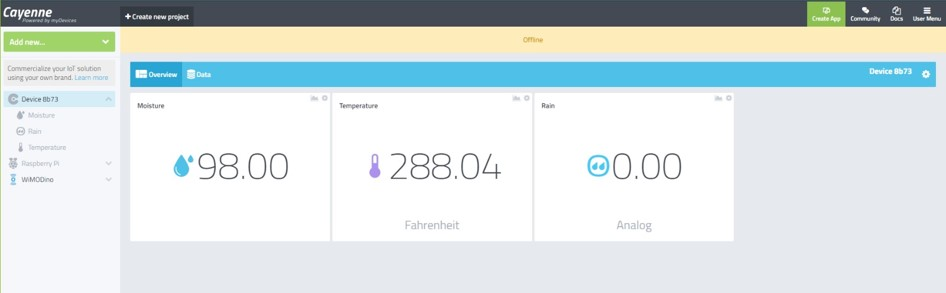

## <center>Resilient smart irrigation system</center>
###<center> Group-B2<br> Project report</center>
######<center> Prashanth K [103626]<br>Prathyum Ramesh [103086]<br>Somrita B [104137]<br>Rupesh Yadav [107102] <br>Mohammadreza [106732] </center>
<br>
<br>
<br>
<br>
<br>
<br>
<br>
<br>
<br>
<br>
<br>
<br>
<br>
<br>
<br>
<br>
<br>
<br>
<br>
<br>
<br>
<br>

<br>
<br>
<br>
<br>
<br>
<br>
<br>
<br>


### __Introduction :__

Smart irriagation systems need to consider the factors such as preserving water supply as well as supplying enough water for the plants to grow.  This ensures that plants grow in favoroble conditions with minimal supervision that also minimize the expense.


By considering factors like temperature, soil mositure and rain forcasting a right condition can be observed to enhance the process of decision making. But when we work around with hardware technology we have to consider that they may have some failures, faults and errors. so the part of resilience is crucial inorder to make a decision. 

There are sensors implanted in the pot for local monitoring which reads the temperature, soil moisture and rain content of the pot and publish the data to the subscriber over the WIFI using `MQTT ` protocol and also stores the data in the cloud. Resilient stratagies have been implemented to ensure the decision making process is not affected in the presence of faults.

__Architecture diagram:__

__Goal:__
To implement a completely resilient smart irrigation system which makes accurate decisions with the collected data.


### __Task Description :__

__Task 1 :__ 
__Hardware Setup :__ 
  In this step we have to setup our local monitoring system using the given hardware :

    - Raspberry Pi B+ V1.6.
    - Netgear 10/100M Switch.
    - TP-Link Wireless Nano Router.
    - ESP32 TTGO.
    - AM2303 (DHT22) Temperature sensor.
    - Capacitive Soil Moisture Sensor V1.2.
    - Rain drop detector MH-RD.

The subscriber node setup is as follows: 

Here we used the Raspberry Pi B+ V1.6 as the subscriber node. The connection over WiFi is established with the Netgear 10/100M Switch along with the TP-Link Wireless Nano Router. This enables our subscriber node to receive data over WiFi from our local sensors.

The edge node setup :


Here we have our ESP32 TTGO connected to the bread board. This is our edge node which collects all the data from the sensors and pushes to the subscriber node.

Every sensors ground is connected to the ground pin of the ESP32 (GND). The power supply to the sensors is provided through the  voltage pin (5V) of ESP32. All the ground and voltage connections are connected in series using breadboard. The input values from the sensors are received to the ESP32 through the output pins 1039, 1036 and 1015.
```c
const int moisturePin = 39; //1039
const int tempPin = 36; // 1036
const int rainCapturePin = 15; //1015
```

Once the ESP32 is powered up using usb cable it will start receiving the values from sensors.

__Responsible team members:__
  - Prathyum Ramesh
  - Prashanth K.

__Task 2 :__ 
__Collecting data from all sensors via the edge node:__

In this step we write the arduino code to collect the local sensor outputs from our edge node. 

``` c

void getData(){
  rainSensorVal = digitalRead(rainCapturePin);
  tempSensorVal = analogRead(tempPin);
  moistureSensorVal = map(analogRead(moisturePin),wet,dry,100,0);
}
```


| Sensor             |   value   |         Decision |
| ------------------ | :-------: | ---------------: |
| Rain sensor analog |     0     |             Rain |
| Rain sensor analog |     1     |          No Rain |
| Moisture           | 3900-4200 | 90 to 100% moist |
| Moisture           | 1995-2400 |   0 to 10% moist |
 when the sensors are placed in a dry environment we receive the following values.

 

This shows the soil content is in a dry state and the pot needs to receive water.

When the sensors are placed in a wet environment we receive the following values.


This shows the soil content is in a wet state and the pot does not need any water supply.

__Responsible team members:__
  - Somrita
  - Prashanth K.

__Task 3 :__ 
__Fetching data from public weather forecast service:__

This step adds the resilience feature to the setup.
Here the data is collected from a third-party API (OpenWeatherAPI) which can be used during the event of sensor failure.

```c
void getOpenWeatherApiData()
{
  if(WiFi.status()== WL_CONNECTED){
        String serverPath = "http://api.openweathermap.org/data/2.5/weather?q=" + city + "," + countryCode + "&APPID=" + openWeatherMapApiKey;
        jsonBuffer = httpGETRequest(serverPath.c_str());
        // JSON.typeof(jsonVar) can be used to get the type of the var
        JSONVar myObject = JSON.parse(jsonBuffer);
        if (JSON.typeof(myObject) == "undefined") {
              Serial.println("Parsing input failed!");
              return;
        }
      tempApiVal = myObject["main"]["temp"]; 
      rainSensorApivalue = myObject["weather"][0]["main"];
    }
    else {
      Serial.println("WiFi Disconnected");
    }
  }
```

The local sensor values are replaced with the values received from the API in our edge node and the irrigation process is performed again based on the received data.


__Responsible team members:__
  - Mohammadreza
  - Prathyum Ramesh
  
__Task 4 :__ 
__Sending data from Publisher (ESP32) to Subscriber (Pi) via MQTT over WiFi:__

Once the ESP32 has received the valid data, it has to be sent to the subscriber node (Pi). 
The data is transmitted using the MQTT protocol. This is performed by setting up a MQTT server which is constantly listening to the publisher (ESP32). The connection between the nodes is established by MQTT broker which links the IP addresses of the subscriber and publisher nodes.

```c
void connectMQTT(){

  if (client.connect(clientID_PI, mqtt_username, mqtt_password)) {
    Serial.println("Connected to MQTT Broker!");
  }
  else {
    Serial.println("Connection to MQTT Broker failed...");
  } 
}
```

Once the nodes are connected successfully via the broker, the data is periodically sent to the subscriber over WiFi.


In order to display the incoming data in a local server, [node-red](https://nodered.org/docs/getting-started/raspberrypi) is used. This enables the user interface between the two nodes.

__Responsible team members:__
  - Prashanth K.
  - Prathyum Ramesh

__Task 5 :__ 
__Connecting the Pi and ESP32 to a third party gateway and storing the data on the cloud:__


In this step, the collected data is stored and visualized in the cloud [(Cayenne)](https://cayenne.mydevices.com/cayenne/dashboard/device/6033ba60-e3e9-11eb-b767-3f1a8f1211ba).
This is another resilience feature where, if the edge node completely fails and no data is transmitted from the ESP32, the decision for irrigation is made based on the previously collected data.


This also sends the decision as an alert to the registered email-id. 


__Responsible team members:__
  - Prashanth K.
  - Rupesh yadav

__Conclusion:__

The smart irrigation system has been connected successfully and all the data is communicated between the two nodes in a resilient manner.
This ensures that the decision making process is accurate and fault tolerant.


